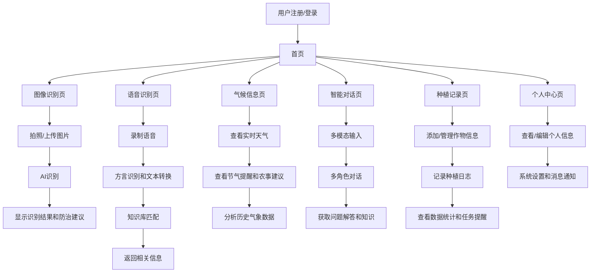

# 农业智能辅助系统产品需求文档

## 1. 产品概览
农业智能辅助系统是一款整合AI图像识别、语音识别、大数据分析等技术的智能化农业管理工具，旨在提升农业生产的智能化水平，降低病虫害识别门槛，提高农事管理效率。

本系统解决传统农业管理方式在病虫害识别精度、农事建议时效性、信息交互便捷性等方面的不足，为农户、农业企业和科研人员提供全方位的农业智能辅助服务。

产品目标是成为农业生产的智能助手，通过技术赋能，推动农业向精准化、智能化方向发展，最终实现农业增产增效、农民增收。

## 2. 核心功能

### 2.1 用户角色
| 角色 | 注册方式 | 核心权限 |
|------|---------|----------|
| 农户 | 手机号注册 | 基础功能使用（图像识别、语音识别、气候查询、智能对话、种植记录） |
| 农业企业 | 企业认证注册 | 批量作物管理、数据统计分析、团队协作 |
| 科研人员 | 机构认证注册 | 数据获取、科研分析、模型训练 |

### 2.2 功能模块
我们的农业智能辅助系统包含以下主要页面：
1. **首页**：功能入口、天气信息、推荐内容、快捷操作
2. **图像识别页**：拍照上传、相册选择、识别结果展示、防治建议
3. **语音识别页**：语音录制、方言识别、文本转换、知识库匹配
4. **气候信息页**：实时天气、节气提醒、农事建议、历史数据
5. **智能对话页**：多角色交互、多模态输入、问题解答、知识获取
6. **种植记录页**：作物管理、种植日志、数据统计、任务提醒
7. **个人中心页**：用户信息、设置、消息通知、帮助中心

### 2.3 页面详情
| 页面名称 | 模块名称 | 功能描述 |
|---------|---------|----------|
| 首页 | 功能入口 | 提供六大核心模块的快捷入口，方便用户快速访问 |
| 首页 | 天气信息 | 显示当前位置的实时天气状况和未来天气预报 |
| 首页 | 推荐内容 | 根据用户地域和种植类型，推送个性化农业资讯和技术指导 |
| 首页 | 快捷操作 | 提供常用功能的一键操作，如快速拍照识别、语音提问等 |
| 图像识别页 | 拍照上传 | 支持实时拍照上传，自动聚焦病斑区域 |
| 图像识别页 | 相册选择 | 支持从相册中选择图片进行识别 |
| 图像识别页 | 识别结果展示 | 显示识别出的病虫害名称、置信度、病斑标注 |
| 图像识别页 | 防治建议 | 根据识别结果提供针对性的防治措施和用药建议 |
| 语音识别页 | 语音录制 | 支持长按录制语音，适应不同方言环境 |
| 语音识别页 | 方言识别 | 支持多种地方方言的识别和转换 |
| 语音识别页 | 文本转换 | 将语音转换为文本，方便用户查看和编辑 |
| 语音识别页 | 知识库匹配 | 根据转换后的文本，匹配相关农业知识和解决方案 |
| 气候信息页 | 实时天气 | 显示当前位置的实时温度、湿度、风力等气象数据 |
| 气候信息页 | 节气提醒 | 根据农历节气，提供相应的农事活动提醒 |
| 气候信息页 | 农事建议 | 根据天气情况和节气，提供针对性的农事操作建议 |
| 气候信息页 | 历史数据 | 展示历史气象数据，帮助用户分析气候变化趋势 |
| 智能对话页 | 多角色交互 | 支持与不同角色（如农业专家、技术顾问）进行对话 |
| 智能对话页 | 多模态输入 | 支持文本、语音、图像等多种输入方式 |
| 智能对话页 | 问题解答 | 回答用户关于农业生产的各类问题 |
| 智能对话页 | 知识获取 | 提供农业知识库查询和学习功能 |
| 种植记录页 | 作物管理 | 支持添加、编辑、删除种植的作物信息 |
| 种植记录页 | 种植日志 | 记录作物的生长状况、农事操作、病虫害情况等 |
| 种植记录页 | 数据统计 | 对种植数据进行统计分析，生成可视化报表 |
| 种植记录页 | 任务提醒 | 根据作物生长周期，设置和提醒相关农事任务 |
| 个人中心页 | 用户信息 | 展示和编辑用户基本信息、认证状态等 |
| 个人中心页 | 设置 | 提供系统设置、隐私设置、通知设置等功能 |
| 个人中心页 | 消息通知 | 接收系统消息、农事提醒、活动通知等 |
| 个人中心页 | 帮助中心 | 提供常见问题解答、使用指南、联系客服等功能 |

## 3. 核心流程
### 用户操作流程
1. **用户注册/登录**：用户通过手机号注册或登录系统，根据角色类型进行相应的认证。
2. **首页浏览**：用户进入首页，查看天气信息、推荐内容，选择需要使用的功能模块。
3. **图像识别流程**：用户选择拍照或从相册上传图片，系统进行AI识别，返回识别结果和防治建议。
4. **语音识别流程**：用户录制语音，系统进行方言识别和文本转换，匹配知识库并返回相关信息。
5. **气候信息查询**：用户查看实时天气、节气提醒和农事建议，分析历史气象数据。
6. **智能对话交互**：用户通过文本、语音或图像与系统进行对话，获取农业知识和问题解答。
7. **种植记录管理**：用户添加和管理作物信息，记录种植日志，查看数据统计和任务提醒。
8. **个人中心管理**：用户查看和编辑个人信息，进行系统设置，接收消息通知，获取帮助。

### 系统处理流程
1. **前端请求处理**：前端接收用户输入，调用相应的API接口。
2. **后端服务处理**：后端微服务接收请求，调用相应的功能模块进行处理。
3. **AI模型调用**：对于图像识别和语音识别，后端调用AI模型服务进行处理。
4. **数据存储与查询**：后端与数据库交互，存储和查询用户数据、农业数据等。
5. **第三方API集成**：后端调用天气API、地图API等第三方服务获取相关数据。
6. **响应返回**：后端将处理结果返回给前端，前端进行展示。

## 4. 用户接口设计
### 4.1 设计风格
- **主色调**：绿色系（#4CAF50），象征农业和生命力
- **辅助色**：蓝色（#2196F3）用于信息和交互元素，橙色（#FF9800）用于提醒和重点内容
- **按钮样式**：圆角矩形，有轻微的阴影效果，点击时有反馈动画
- **字体**：无衬线字体，清晰易读，标题使用加粗样式
- **布局风格**：卡片式布局，信息层次分明，留白合理
- **图标风格**：线性图标，简洁现代，与农业主题相关

### 4.2 页面设计概览
| 页面名称 | 模块名称 | UI元素 |
|---------|---------|--------|
| 首页 | 功能入口 | 六大核心模块的图标和文字，采用网格布局，图标使用彩色填充，文字清晰易读 |
| 首页 | 天气信息 | 顶部卡片式展示，包含天气图标、温度、湿度、风力等信息，背景根据天气状况变化 |
| 首页 | 推荐内容 | 下方滚动卡片，每张卡片包含标题、摘要和图片，点击可查看详情 |
| 首页 | 快捷操作 | 底部浮动按钮，用于快速拍照识别和语音提问 |
| 图像识别页 | 拍照上传 | 中央相机取景框，底部拍照按钮，支持切换前后摄像头 |
| 图像识别页 | 相册选择 | 底部相册图标，点击可打开相册选择图片 |
| 图像识别页 | 识别结果展示 | 识别完成后显示结果卡片，包含病虫害名称、置信度、病斑标注图片 |
| 图像识别页 | 防治建议 | 识别结果下方的建议卡片，包含防治措施和用药建议，可展开查看详情 |
| 语音识别页 | 语音录制 | 中央大型麦克风图标，长按录制，释放停止 |
| 语音识别页 | 方言识别 | 顶部方言选择下拉菜单，支持切换不同方言 |
| 语音识别页 | 文本转换 | 录制完成后显示转换的文本，支持编辑和复制 |
| 语音识别页 | 知识库匹配 | 文本下方显示匹配的知识库内容，可点击查看详情 |
| 气候信息页 | 实时天气 | 顶部大卡片展示当前天气，包含温度、湿度、风力、气压等信息 |
| 气候信息页 | 节气提醒 | 中部卡片展示当前节气和下一节气，包含节气相关的农事活动建议 |
| 气候信息页 | 农事建议 | 下部卡片根据天气和节气提供针对性的农事操作建议 |
| 气候信息页 | 历史数据 | 底部图表展示历史气象数据，支持切换不同时间段和数据类型 |
| 智能对话页 | 多角色交互 | 顶部角色选择下拉菜单，可切换不同角色进行对话 |
| 智能对话页 | 多模态输入 | 底部输入框，支持文本输入、语音输入和图像输入 |
| 智能对话页 | 问题解答 | 对话界面显示问题和回答，支持上下滚动查看历史对话 |
| 智能对话页 | 知识获取 | 对话中涉及的知识点可点击查看详情，支持收藏和分享 |
| 种植记录页 | 作物管理 | 顶部作物列表，可添加、编辑、删除作物，点击作物进入详情页 |
| 种植记录页 | 种植日志 | 作物详情页中显示种植日志列表，可添加新日志，查看历史日志 |
| 种植记录页 | 数据统计 | 作物详情页中包含数据统计图表，展示作物生长状况和农事操作统计 |
| 种植记录页 | 任务提醒 | 底部任务提醒列表，显示待完成的农事任务，可点击查看详情和标记完成 |
| 个人中心页 | 用户信息 | 顶部用户头像和基本信息，点击可编辑个人资料 |
| 个人中心页 | 设置 | 中部设置项列表，包含系统设置、隐私设置、通知设置等 |
| 个人中心页 | 消息通知 | 底部消息列表，显示系统消息、农事提醒、活动通知等 |
| 个人中心页 | 帮助中心 | 设置项中的帮助中心入口，包含常见问题解答、使用指南、联系客服等 |

### 4.3 自适应
- **移动端**：针对iOS 12.0+和Android 8.0+系统进行适配，采用响应式设计，确保在不同屏幕尺寸下都能正常显示和操作。
- **Web端**：兼容Chrome、Firefox、Safari等高版本浏览器，采用响应式布局，适配不同屏幕尺寸。
- **触摸交互**：移动端优化触摸交互体验，增大点击区域，支持手势操作，如滑动、缩放等。
- **键盘适配**：在需要输入的场景下，优化键盘弹出和收起的体验，确保输入框不被遮挡。
- **网络适配**：支持离线模式，在网络不佳时仍能使用部分功能，如查看已缓存的种植记录、历史识别结果等。

## 5. 技术架构
### 5.1 系统架构
- **前端**：采用前后端分离架构，移动端使用React Native或Flutter开发，Web端使用React或Vue开发。
- **后端**：采用微服务架构，将各核心功能拆分为独立服务，包括图像识别服务、方言识别服务、气候数据服务、智能对话服务、种植记录服务、个性化推荐服务等。
- **API网关**：统一管理API接口，实现请求路由、负载均衡、认证授权等功能。
- **AI模型服务**：部署病虫害识别模型、语音转写模型等AI模型，提供模型推理服务。
- **数据库服务**：使用关系型数据库（如MySQL）存储用户数据、种植记录等结构化数据，使用非关系型数据库（如MongoDB）存储图像、语音等非结构化数据。
- **第三方服务**：集成天气API、地图API等第三方服务，获取相关数据。

### 5.2 技术栈
- **前端**：React Native/Flutter（移动端），React/Vue（Web端），Redux/Vuex（状态管理），Axios/Fetch（网络请求）。
- **后端**：Spring Boot（Java）/Django（Python），Spring Cloud（微服务框架），Nginx（反向代理），Redis（缓存）。
- **AI模型**：TensorFlow/PyTorch（模型训练），ONNX（模型部署），OpenCV（图像处理）。
- **数据库**：MySQL（关系型数据库），MongoDB（非关系型数据库），Elasticsearch（搜索引擎）。
- **DevOps**：Docker（容器化），Kubernetes（容器编排），Jenkins（CI/CD）。

### 5.3 安全考虑
- **数据加密**：对用户敏感数据进行加密存储，传输过程中使用HTTPS协议。
- **认证授权**：采用JWT或OAuth2.0进行用户认证，基于角色的访问控制（RBAC）进行权限管理。
- **API安全**：实现API接口的速率限制、参数校验、防SQL注入等安全措施。
- **AI模型安全**：保护AI模型的知识产权，防止模型被恶意攻击或滥用。
- **数据隐私**：遵守数据隐私相关法律法规，明确用户数据的使用范围和目的。

## 6. 项目管理
### 6.1 开发计划
- **需求分析与设计阶段**：2周，完成PRD文档、技术架构设计、UI/UX设计。
- **前端开发阶段**：8周，完成移动端和Web端的开发和测试。
- **后端开发阶段**：10周，完成微服务架构搭建、API接口开发、AI模型集成。
- **测试阶段**：4周，进行功能测试、性能测试、安全测试。
- **部署与上线阶段**：2周，完成系统部署、上线准备、用户培训。

### 6.2 团队组成
- **产品经理**：1名，负责需求分析、产品设计、项目管理。
- **UI/UX设计师**：1名，负责界面设计、用户体验设计。
- **前端开发**：2名，负责移动端和Web端的开发。
- **后端开发**：3名，负责微服务架构搭建、API接口开发。
- **AI工程师**：2名，负责AI模型训练、部署和集成。
- **测试工程师**：1名，负责系统测试、质量保证。
- **运维工程师**：1名，负责系统部署、监控和维护。

### 6.3 风险评估
- **技术风险**：AI模型的识别精度和性能可能无法满足预期要求，需要持续优化和改进。
- **数据风险**：农业数据的质量和数量可能不足，影响AI模型的训练效果和系统的推荐准确性。
- **用户接受度**：农户可能对新系统的使用存在障碍，需要加强培训和支持。
- **系统稳定性**：微服务架构的复杂性可能导致系统稳定性问题，需要加强监控和管理。
- **合规风险**：数据隐私和安全相关的法律法规要求可能发生变化，需要及时调整系统设计。

## 7. 总结与展望
农业智能辅助系统通过整合AI图像识别、语音识别、大数据分析等技术，为农户、农业企业和科研人员提供全方位的农业智能辅助服务，有望显著提升农业生产的智能化水平，降低病虫害识别门槛，提高农事管理效率。

未来，我们计划进一步扩展系统功能，如增加无人机巡检、智能灌溉控制、农产品溯源等功能，构建更加完整的农业智能化生态系统。同时，我们将持续优化AI模型，提高识别精度和性能，为用户提供更加准确、个性化的服务。

通过不断创新和改进，农业智能辅助系统有望成为农业生产的重要工具，推动农业向精准化、智能化方向发展，为实现农业现代化做出贡献。