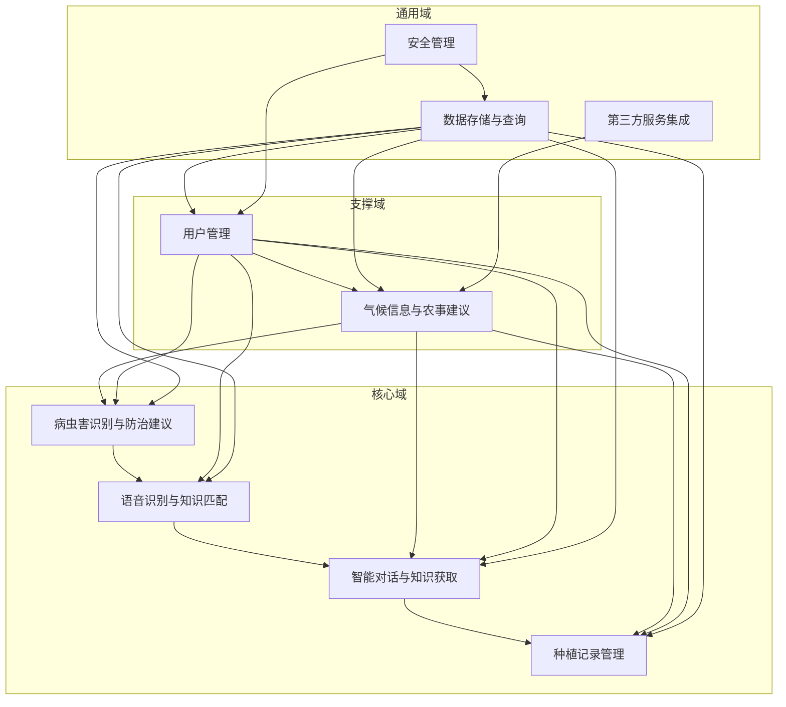

# 农业智能辅助系统领域模型

## 【战略设计】

### 业务背景与核心目标
- **业务背景**：传统农业管理方式在病虫害识别精度、农事建议时效性、信息交互便捷性等方面存在不足，需要通过智能化技术提升农业生产水平。
- **核心目标**：整合AI图像识别、语音识别、大数据分析等技术，为农户、农业企业和科研人员提供全方位的农业智能辅助服务，提升农业生产的智能化水平，降低病虫害识别门槛，提高农事管理效率。
- **核心价值**：通过技术赋能，推动农业向精准化、智能化方向发展，最终实现农业增产增效、农民增收。

### 核心价值流
1. **病虫害识别与防治建议**：通过AI图像识别技术，识别作物病虫害并提供防治建议。
2. **语音识别与知识匹配**：通过语音识别技术，理解用户语音需求并匹配相关农业知识。
3. **气候信息与农事建议**：获取实时天气和节气信息，提供针对性的农事操作建议。
4. **智能对话与知识获取**：通过多模态交互，为用户提供农业知识和问题解答。
5. **种植记录管理**：记录和管理作物种植信息，提供数据统计和任务提醒。
6. **用户管理**：管理用户信息和权限，支持不同角色的注册和认证。

### 域划分
- **核心域**：
  - 病虫害识别与防治建议
  - 语音识别与知识匹配
  - 智能对话与知识获取
  - 种植记录管理
- **支撑域**：
  - 气候信息与农事建议
  - 用户管理
- **通用域**：
  - 数据存储与查询
  - 第三方服务集成
  - 安全管理

## 【上下文映射】

### 上下文边界
| 边界 | 域 | 描述 |
|------|------|------|
| 病虫害识别边界 | 病虫害识别与防治建议 | 负责图像识别、病虫害分类、防治建议生成 |
| 语音识别边界 | 语音识别与知识匹配 | 负责语音录制、方言识别、文本转换、知识库匹配 |
| 气候信息边界 | 气候信息与农事建议 | 负责获取实时天气、节气信息、生成农事建议 |
| 智能对话边界 | 智能对话与知识获取 | 负责多模态交互、多角色对话、问题解答、知识获取 |
| 种植记录边界 | 种植记录管理 | 负责作物管理、种植日志记录、数据统计、任务提醒 |
| 用户管理边界 | 用户管理 | 负责用户注册、登录、认证、权限管理 |
| 数据存储边界 | 数据存储与查询 | 负责数据存储、查询、缓存 |
| 第三方集成边界 | 第三方服务集成 | 负责集成天气API、地图API等第三方服务 |
| 安全边界 | 安全管理 | 负责数据加密、认证授权、API安全 |

### 上下文映射关系

## 【战术模型】

### 实体（Entities）
1. **用户（User）**
   - 属性：用户ID、手机号、密码、角色（农户/农业企业/科研人员）、认证状态、基本信息
   - 关系：拥有作物、拥有种植日志、拥有智能对话

2. **作物（Crop）**
   - 属性：作物ID、名称、品种、种植面积、种植日期、生长阶段、状态
   - 关系：属于用户、拥有种植日志、拥有任务提醒

3. **种植日志（PlantingLog）**
   - 属性：日志ID、作物ID、记录日期、内容（生长状况、农事操作、病虫害情况）、图片
   - 关系：属于用户、属于作物

4. **识别结果（RecognitionResult）**
   - 属性：结果ID、用户ID、图片、识别时间、病虫害名称、置信度、病斑标注
   - 关系：属于用户、关联防治建议

5. **防治建议（ControlSuggestion）**
   - 属性：建议ID、识别结果ID、防治措施、用药建议、注意事项
   - 关系：关联识别结果

6. **语音识别结果（VoiceRecognitionResult）**
   - 属性：结果ID、用户ID、语音文件、识别时间、转换文本、方言类型
   - 关系：属于用户、关联知识库匹配结果

7. **知识库匹配结果（KnowledgeBaseMatchResult）**
   - 属性：结果ID、语音识别结果ID、匹配知识、相关度
   - 关系：关联语音识别结果

8. **气候信息（ClimateInfo）**
   - 属性：信息ID、位置、日期、温度、湿度、风力、天气状况、节气
   - 关系：关联农事建议

9. **农事建议（FarmingSuggestion）**
   - 属性：建议ID、气候信息ID、建议内容、适用作物类型
   - 关系：关联气候信息

10. **智能对话（IntelligentDialog）**
    - 属性：对话ID、用户ID、开始时间、结束时间、角色类型
    - 关系：属于用户、拥有对话消息

11. **对话消息（DialogMessage）**
    - 属性：消息ID、对话ID、发送方（用户/系统）、内容、发送时间、消息类型（文本/语音/图像）
    - 关系：属于智能对话

12. **任务提醒（TaskReminder）**
    - 属性：提醒ID、作物ID、提醒内容、提醒时间、状态（待完成/已完成）
    - 关系：属于作物

### 值对象（Value Objects）
1. **位置（Location）**：经度、纬度、地址
2. **时间范围（TimeRange）**：开始时间、结束时间
3. **图片（Image）**：文件路径、格式、大小、拍摄时间
4. **语音文件（VoiceFile）**：文件路径、格式、时长、录制时间
5. **病虫害信息（PestInfo）**：名称、类型、症状描述、危害程度
6. **用药建议（MedicationSuggestion）**：药品名称、使用方法、剂量、注意事项
7. **生长阶段（GrowthStage）**：阶段名称、时间范围、特征描述
8. **天气状况（WeatherCondition）**：温度、湿度、风力、天气类型、气压
9. **节气信息（SolarTermInfo）**：节气名称、日期、相关农事活动

### 聚合根（Aggregate Roots）
1. **用户（User）**：管理用户信息和权限，是作物、种植日志、智能对话的聚合根
2. **作物（Crop）**：管理作物信息和相关的种植日志、任务提醒，是种植日志、任务提醒的聚合根
3. **识别结果（RecognitionResult）**：管理识别结果和相关的防治建议，是防治建议的聚合根
4. **语音识别结果（VoiceRecognitionResult）**：管理语音识别结果和相关的知识库匹配结果，是知识库匹配结果的聚合根
5. **气候信息（ClimateInfo）**：管理气候信息和相关的农事建议，是农事建议的聚合根
6. **智能对话（IntelligentDialog）**：管理智能对话和相关的对话消息，是对话消息的聚合根

### 领域服务（Domain Services）
1. **图像识别服务（ImageRecognitionService）**：提供图像识别功能，识别病虫害并生成防治建议
2. **语音识别服务（VoiceRecognitionService）**：提供语音识别功能，转换语音为文本并匹配知识库
3. **气候服务（ClimateService）**：获取实时天气和节气信息，生成农事建议
4. **智能对话服务（IntelligentDialogService）**：提供多模态交互和多角色对话功能
5. **种植记录服务（PlantingRecordService）**：管理作物信息、种植日志和任务提醒
6. **用户服务（UserService）**：管理用户注册、登录、认证和权限
7. **知识库服务（KnowledgeBaseService）**：管理农业知识和提供知识查询功能

### 领域事件（Domain Events）
1. **病虫害识别完成事件（PestRecognitionCompletedEvent）**：当图像识别完成时触发
2. **语音识别完成事件（VoiceRecognitionCompletedEvent）**：当语音识别完成时触发
3. **农事建议生成事件（FarmingSuggestionGeneratedEvent）**：当农事建议生成时触发
4. **智能对话结束事件（IntelligentDialogEndedEvent）**：当智能对话结束时触发
5. **种植日志创建事件（PlantingLogCreatedEvent）**：当种植日志创建时触发
6. **任务提醒创建事件（TaskReminderCreatedEvent）**：当任务提醒创建时触发
7. **用户注册完成事件（UserRegistrationCompletedEvent）**：当用户注册完成时触发
8. **用户认证完成事件（UserAuthenticationCompletedEvent）**：当用户认证完成时触发

### 仓储（Repository）
1. **用户仓储（UserRepository）**：存储和查询用户信息
2. **作物仓储（CropRepository）**：存储和查询作物信息
3. **种植日志仓储（PlantingLogRepository）**：存储和查询种植日志
4. **识别结果仓储（RecognitionResultRepository）**：存储和查询识别结果
5. **语音识别结果仓储（VoiceRecognitionResultRepository）**：存储和查询语音识别结果
6. **气候信息仓储（ClimateInfoRepository）**：存储和查询气候信息
7. **智能对话仓储（IntelligentDialogRepository）**：存储和查询智能对话
8. **任务提醒仓储（TaskReminderRepository）**：存储和查询任务提醒
9. **知识库仓储（KnowledgeBaseRepository）**：存储和查询知识库内容

## 【领域规则】

### 业务规则
1. **用户注册规则**：
   - 农户通过手机号注册，农业企业和科研人员需要进行相应的认证
   - 手机号必须唯一，密码必须符合安全要求

2. **图像识别规则**：
   - 支持实时拍照和相册选择两种方式上传图片
   - 识别结果必须包含病虫害名称、置信度和病斑标注
   - 根据识别结果自动生成防治建议

3. **语音识别规则**：
   - 支持长按录制语音，适应不同方言环境
   - 将语音转换为文本，方便用户查看和编辑
   - 根据转换后的文本匹配相关农业知识

4. **气候信息规则**：
   - 显示当前位置的实时天气状况和未来天气预报
   - 根据农历节气提供相应的农事活动提醒
   - 根据天气情况和节气提供针对性的农事操作建议

5. **智能对话规则**：
   - 支持与不同角色（如农业专家、技术顾问）进行对话
   - 支持文本、语音、图像等多种输入方式
   - 回答用户关于农业生产的各类问题

6. **种植记录规则**：
   - 支持添加、编辑、删除种植的作物信息
   - 记录作物的生长状况、农事操作、病虫害情况等
   - 对种植数据进行统计分析，生成可视化报表
   - 根据作物生长周期设置和提醒相关农事任务

### 状态约束
1. **用户状态**：
   - 未注册 → 已注册 → 已认证（农业企业/科研人员）

2. **作物状态**：
   - 种植中 → 收获 → 结束

3. **任务提醒状态**：
   - 待完成 → 已完成

4. **识别结果状态**：
   - 待识别 → 识别中 → 识别完成

5. **智能对话状态**：
   - 进行中 → 已结束

### 不变量
1. **用户不变量**：
   - 每个用户必须有唯一的用户ID
   - 农业企业和科研人员必须通过认证才能使用相应的功能

2. **作物不变量**：
   - 每个作物必须属于一个用户
   - 作物的生长阶段必须与种植日期和当前日期匹配

3. **种植日志不变量**：
   - 每个种植日志必须属于一个用户和一个作物
   - 种植日志的记录日期不能晚于当前日期

4. **识别结果不变量**：
   - 每个识别结果必须属于一个用户
   - 识别结果必须包含病虫害名称和置信度

5. **智能对话不变量**：
   - 每个智能对话必须属于一个用户
   - 智能对话必须包含至少一条对话消息

## 【演化建议】

### 扩展点
1. **AI模型优化**：
   - 持续收集用户反馈和识别数据，优化病虫害识别模型的精度
   - 扩展语音识别支持的方言种类和准确性

2. **功能扩展**：
   - 增加无人机巡检功能，实现大面积作物的病虫害监测
   - 增加智能灌溉控制功能，根据天气和土壤湿度自动调整灌溉方案
   - 增加农产品溯源功能，实现从种植到销售的全流程追溯

3. **数据集成**：
   - 与农业物联网设备集成，实时获取土壤湿度、温度等数据
   - 与农产品电商平台集成，提供销售渠道和市场信息

4. **用户体验优化**：
   - 增加个性化推荐功能，根据用户的种植历史和偏好提供定制化服务
   - 优化移动端和Web端的用户界面，提高操作便捷性

### 演化路径
1. **第一阶段**：实现核心功能，包括图像识别、语音识别、气候信息、智能对话和种植记录管理
2. **第二阶段**：优化AI模型精度，扩展功能范围，如无人机巡检和智能灌溉控制
3. **第三阶段**：与外部系统集成，构建完整的农业智能化生态系统
4. **第四阶段**：通过大数据分析，提供更精准的农业生产预测和决策支持

## 【术语词典】

| 术语 | 解释 |
|------|------|
| 病虫害识别 | 通过AI图像识别技术，识别作物上的病虫害种类和严重程度 |
| 防治建议 | 根据病虫害识别结果，提供针对性的防治措施和用药建议 |
| 语音识别 | 通过语音识别技术，将用户的语音转换为文本 |
| 方言识别 | 支持识别不同地方方言的语音识别功能 |
| 气候信息 | 包括实时天气、天气预报、节气信息等气象数据 |
| 农事建议 | 根据天气情况和节气，提供针对性的农事操作建议 |
| 智能对话 | 支持与不同角色进行对话，提供农业知识和问题解答 |
| 种植记录 | 记录作物的生长状况、农事操作、病虫害情况等信息 |
| 任务提醒 | 根据作物生长周期，设置和提醒相关的农事任务 |
| 聚合根 | 领域模型中的核心实体，负责管理聚合内的其他实体和值对象 |
| 领域服务 | 封装领域内的业务逻辑，处理跨实体的操作 |
| 领域事件 | 领域内发生的重要事件，用于通知其他组件或系统 |
| 仓储 | 负责存储和查询领域对象的接口 |

## 【模型验证】

### 已确认项目
- 核心价值流和域划分
- 上下文边界和映射关系
- 核心实体、值对象和聚合根
- 领域服务和领域事件
- 业务规则和状态约束

### 待澄清项目
- 具体的AI模型训练和部署细节
- 与第三方服务的具体集成方式
- 数据隐私和安全的具体实现方案
- 系统性能和扩展性的具体要求

### 模型假设
- 用户具备基本的智能手机操作能力
- 系统能够获取足够的农业数据用于AI模型训练
- 第三方服务（如天气API）能够稳定提供数据
- 网络连接在大部分使用场景下是可用的

### 风险点
- AI模型的识别精度可能无法满足所有场景的需求
- 农户对新系统的接受度和使用习惯需要时间培养
- 系统稳定性和安全性需要持续关注
- 数据隐私和合规要求可能会发生变化
